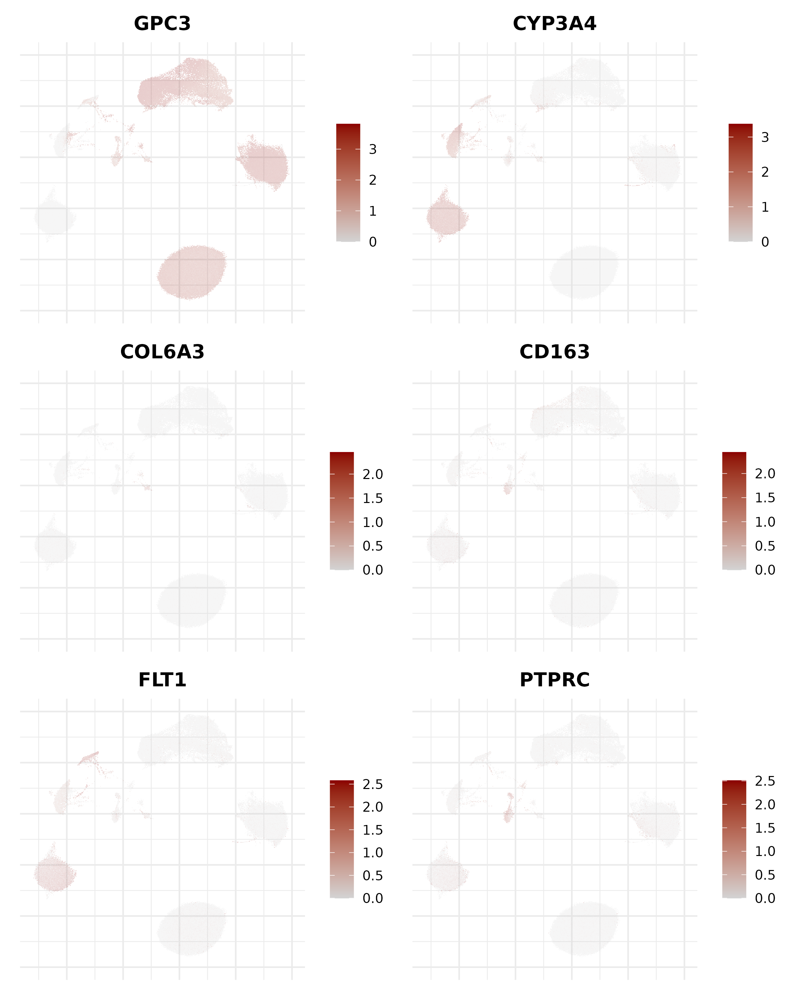

# BF528 Final Project
 
 This is the final project for BF528. This project investigates a scrna-seq datatset.
 
 Selected Paper: 1
 
## Pre-processing

First Let's load in the necessary libraries

```{r setup, include=FALSE}
library(Seurat)
library(tidyverse)
library(ggplot2)
library(DoubletFinder)
library(devtools)
```

Here we load in the data files from the paper. We load it in as a seurat object so that we can perform necessary analysis.

```{r}
HB17_BKRr <- Read10X(data.dir = 'HB17_background_raw_feature_bc_matrix')
HB17_BKRr <- CreateSeuratObject(counts =HB17_BKRr, project = "HB17_BKRr", min.cells = 3, min.features = 200)

HB17_PDXr <- Read10X(data.dir = 'HB17_PDX_raw_feature_bc_matrix')
HB17_PDXr <- CreateSeuratObject(counts = HB17_PDXr, project = "HB17_PDXr", min.cells = 3, min.features = 200)

HB17_TMRr <- Read10X(data.dir = 'HB17_tumor_raw_feature_bc_matrix')
HB17_TMRr <- CreateSeuratObject(counts =HB17_TMRr, project = "HB17_TMRr", min.cells = 3, min.features = 200)

HB30_PDXr <- Read10X(data.dir = 'HB30_PDX_raw_feature_bc_matrix')
HB30_PDXr <- CreateSeuratObject(counts = HB30_PDXr, project = "HB30_PDXr", min.cells = 3, min.features = 200)

HB30_TMRr <- Read10X(data.dir = 'HB30_tumor_raw_feature_bc_matrix')
HB30_TMRr <- CreateSeuratObject(counts = HB30_TMRr, project = "HB30_TMRr", min.cells = 3, min.features = 200)

HB53_BKRr <- Read10X(data.dir = 'HB53_background_raw_feature_bc_matrix')
HB53_BKRr <- CreateSeuratObject(counts = HB53_BKRr, project = "HB53_BKRr", min.cells = 3, min.features = 200)

HB53_TMRr <- Read10X(data.dir = 'HB53_tumor_raw_feature_bc_matrix')
HB53_TMRr <- CreateSeuratObject(counts = HB53_TMRr, project = "HB53_TMRr", min.cells = 3, min.features = 200)
```

Take a look at the number of cells within each sample:

```{r}
tibble(
  Sample = c("HB17_BKRr", "HB17_PDXr", "HB17_TMRr",
             "HB30_PDXr", "HB30_TMRr", "HB53_BKRr", "HB53_TMRr"),
  Num_Cells = c(ncol(HB17_BKRr), ncol(HB17_PDXr), ncol(HB17_TMRr),
                ncol(HB30_PDXr), ncol(HB30_TMRr), ncol(HB53_BKRr), ncol(HB53_TMRr))
)
```

Here we take a look at the mitochondrial content:

```{r}
# HB17_BKR, HB17_PDX, HB17_TMR, HB30_PDX, HB30_TMR, HB53_BKR, HB53_TMR
HB17_BKRr[["percent.mt"]] <- PercentageFeatureSet(HB17_BKRr, pattern = "^MT-")
HB17_PDXr[["percent.mt"]] <- PercentageFeatureSet(HB17_PDXr, pattern = "^MT-")
HB17_TMRr[["percent.mt"]] <- PercentageFeatureSet(HB17_TMRr, pattern = "^MT-")
HB30_PDXr[["percent.mt"]] <- PercentageFeatureSet(HB30_PDXr, pattern = "^MT-")
HB30_TMRr[["percent.mt"]] <- PercentageFeatureSet(HB30_TMRr, pattern = "^MT-")
HB53_BKRr[["percent.mt"]] <- PercentageFeatureSet(HB53_BKRr, pattern = "^MT-")
HB53_TMRr[["percent.mt"]] <- PercentageFeatureSet(HB53_TMRr, pattern = "^MT-")
```

And the violin plots for each sample. These plots will help us subset the files to clean the data.

```{r}
# Visualize QC metrics as a violin plot
VlnPlot(HB17_BKRr, features = c("nFeature_RNA", "nCount_RNA", "percent.mt"), ncol = 3)
VlnPlot(HB17_PDXr, features = c("nFeature_RNA", "nCount_RNA", "percent.mt"), ncol = 3)
VlnPlot(HB17_TMRr, features = c("nFeature_RNA", "nCount_RNA", "percent.mt"), ncol = 3)
VlnPlot(HB30_PDXr, features = c("nFeature_RNA", "nCount_RNA", "percent.mt"), ncol = 3)
VlnPlot(HB30_TMRr, features = c("nFeature_RNA", "nCount_RNA", "percent.mt"), ncol = 3)
VlnPlot(HB53_BKRr, features = c("nFeature_RNA", "nCount_RNA", "percent.mt"), ncol = 3)
VlnPlot(HB53_TMRr, features = c("nFeature_RNA", "nCount_RNA", "percent.mt"), ncol = 3)
```

* Discussion: Preprocessing *

For each plot, I set thresholds for the RNA counts, RNA features and the percentage of mitochondrial presence. The threshold was determined by where the data became sparse and introduced potential outliers. 

For each of the samples, there is only a difference of about 100 cells from the original data set to the filtered data set. The sample with the fewest cell was the first sample under the variable name 'HB17_BKR'

There are filtering strategies that don't rely on visual inspection, but rather statistical outliers to remove noise from the data. This is a much cleaner way of filtering data, but is more computationally intensive. 

### Subsetting Data

Here we subset the data based on visual threshold determination from the violin plots

```{r}
#subset
HB17_BKR <- subset(HB17_BKRr, subset = nFeature_RNA < 3000 & nCount_RNA < 20000 & percent.mt < 20)

HB17_PDX <- subset(HB17_PDXr, subset = nFeature_RNA < 6000 & nCount_RNA < 30000 & percent.mt < 7.5)

HB17_TMR <- subset(HB17_TMRr, subset = nFeature_RNA < 6000 & nCount_RNA < 30000 & percent.mt < 7.5)

HB30_PDX <- subset(HB30_PDXr, subset = nFeature_RNA < 6000 & nCount_RNA < 30000 & percent.mt < 10)

HB30_TMR <- subset(HB30_TMRr, subset = nFeature_RNA < 6000 & nCount_RNA < 30000 & percent.mt < 7.5)

HB53_BKR <- subset(HB53_BKRr, subset = nFeature_RNA < 6000 & nCount_RNA < 30000 & percent.mt < 7.5)

HB53_TMR <- subset(HB53_TMRr, subset = nFeature_RNA < 5000 & nCount_RNA < 30000 & percent.mt < 10)

```

Create a table to show the number of cell left after subsetting

```{r}
tibble(
  Sample = c("HB17_BKR", "HB17_PDX", "HB17_TMR",
             "HB30_PDX", "HB30_TMR", "HB53_BKR", "HB53_TMR"),
  Num_Cells = c(ncol(HB17_BKR), ncol(HB17_PDX), ncol(HB17_TMR),
                ncol(HB30_PDX), ncol(HB30_TMR), ncol(HB53_BKR), ncol(HB53_TMR))
)
```

### Normalization, PCA, and UMAP for each file

* Discussion: Count Normalization *

Here we perform Normalization, PCA, and UMAP for each sample. We use the default normalization method for the data. The function centers to zero mean and scaling to unit variance. 

* Discussion: Feature Selection *

We used the default function that determines the variable features. FindVariableFeatures identifies variable features while controlling for the strong relationship between variability and average expression.

* Discussion: PCA *

An elbow plot was produced to analyze for optimal dimensions in the PCA. Given the curve, we decided to move forward with 20 dimension. This was applied to all samples to ensure consistency.

```{r}
HB17_BKR <- NormalizeData(HB17_BKR)
HB17_BKR <- FindVariableFeatures(HB17_BKR)
HB17_BKR <- ScaleData(HB17_BKR)

ElbowPlot(HB17_BKR)

HB17_BKR <- RunPCA(HB17_BKR)
HB17_BKR <- FindNeighbors(HB17_BKR, dims = 1:20, reduction = "pca")
HB17_BKR <- FindClusters(HB17_BKR, resolution = 0.5, cluster.name = "unintegrated_clusters")
HB17_BKR <- RunUMAP(HB17_BKR, dims = 1:20, reduction = "pca", reduction.name = "umap.unintegrated")
```

```{r}
HB17_PDX <- NormalizeData(HB17_PDX)
HB17_PDX <- FindVariableFeatures(HB17_PDX)
HB17_PDX <- ScaleData(HB17_PDX)
HB17_PDX <- RunPCA(HB17_PDX)
HB17_PDX <- FindNeighbors(HB17_PDX, dims = 1:20, reduction = "pca")
HB17_PDX <- FindClusters(HB17_PDX, resolution = 0.5, cluster.name = "unintegrated_clusters")
HB17_PDX <- RunUMAP(HB17_PDX, dims = 1:20, reduction = "pca", reduction.name = "umap.unintegrated")
```

```{r}
HB17_TMR <- NormalizeData(HB17_TMR)
HB17_TMR <- FindVariableFeatures(HB17_TMR)
HB17_TMR <- ScaleData(HB17_TMR)
HB17_TMR <- RunPCA(HB17_TMR)
HB17_TMR <- FindNeighbors(HB17_TMR, dims = 1:20, reduction = "pca")
HB17_TMR <- FindClusters(HB17_TMR, resolution = 0.5, cluster.name = "unintegrated_clusters")
HB17_TMR <- RunUMAP(HB17_TMR, dims = 1:20, reduction = "pca", reduction.name = "umap.unintegrated")
```

```{r}
HB30_PDX <- NormalizeData(HB30_PDX)
HB30_PDX <- FindVariableFeatures(HB30_PDX)
HB30_PDX <- ScaleData(HB30_PDX)
HB30_PDX <- RunPCA(HB30_PDX)
HB30_PDX <- FindNeighbors(HB30_PDX, dims = 1:20, reduction = "pca")
HB30_PDX <- FindClusters(HB30_PDX, resolution = 0.5, cluster.name = "unintegrated_clusters")
HB30_PDX <- RunUMAP(HB30_PDX, dims = 1:20, reduction = "pca", reduction.name = "umap.unintegrated")
```

```{r}
HB30_TMR <- NormalizeData(HB30_TMR)
HB30_TMR <- FindVariableFeatures(HB30_TMR)
HB30_TMR <- ScaleData(HB30_TMR)
HB30_TMR <- RunPCA(HB30_TMR)
HB30_TMR <- FindNeighbors(HB30_TMR, dims = 1:20, reduction = "pca")
HB30_TMR <- FindClusters(HB30_TMR, resolution = 0.5, cluster.name = "unintegrated_clusters")
HB30_TMR <- RunUMAP(HB30_TMR, dims = 1:20, reduction = "pca", reduction.name = "umap.unintegrated")
```

```{r}
HB53_BKR <- NormalizeData(HB53_BKR)
HB53_BKR <- FindVariableFeatures(HB53_BKR)
HB53_BKR <- ScaleData(HB53_BKR)
HB53_BKR <- RunPCA(HB53_BKR)
HB53_BKR <- FindNeighbors(HB53_BKR, dims = 1:20, reduction = "pca")
HB53_BKR <- FindClusters(HB53_BKR, resolution = 0.5, cluster.name = "unintegrated_clusters")
HB53_BKR <- RunUMAP(HB53_BKR, dims = 1:20, reduction = "pca", reduction.name = "umap.unintegrated")
```

```{r}
HB53_TMR <- NormalizeData(HB53_TMR)
HB53_TMR <- FindVariableFeatures(HB53_TMR)
HB53_TMR <- ScaleData(HB53_TMR)
HB53_TMR <- RunPCA(HB53_TMR)
HB53_TMR <- FindNeighbors(HB53_TMR, dims = 1:20, reduction = "pca")
HB53_TMR <- FindClusters(HB53_TMR, resolution = 0.5, cluster.name = "unintegrated_clusters")
HB53_TMR <- RunUMAP(HB53_TMR, dims = 1:20, reduction = "pca", reduction.name = "umap.unintegrated")
```

### Prep for DoubletFinder with Sweep

Here we prepare the subsetted formatted files for doublet finder and look at the pK values

```{r}
HB17_BKR_sweepres <- paramSweep(HB17_BKR, PCs = 1:20, sct = FALSE)
HB17_BKR_stats <- summarizeSweep(HB17_BKR_sweepres, GT = FALSE)
bcmvn_HB17_BKR <- find.pK(HB17_BKR_stats)

ggplot(bcmvn_HB17_BKR, aes(pK, BCmetric, group = 1)) +
  geom_point() +
  geom_line()

pK_HB17_BKR <- bcmvn_HB17_BKR %>%
  filter(BCmetric == max(BCmetric)) %>%
  select(pK)

pK_HB17_BKR <- as.numeric(as.character(pK_HB17_BKR[[1]]))

annotations_HB17_BKR <- HB17_BKR@meta.data$seurat_clusters
homotypic_HB17_BKR <- modelHomotypic(annotations_HB17_BKR)
nExp_poi_HB17_BKR <- round(0.076*nrow(HB17_BKR@meta.data))
nExp_adj_HB17_BKR <- round(nExp_poi_HB17_BKR*(1-homotypic_HB17_BKR))
```

Here we apply DoubletFinder and assign it to another seurat object with the prefix 'DD' 

```{r}
DD_HB17_BKR <- doubletFinder(HB17_BKR,
                             PCs = 1:20,
                             pN = 0.25,
                             pK = pK_HB17_BKR,
                             nExp = nExp_adj_HB17_BKR,
                             sct = FALSE)
```

We repeat the process for all samples

```{r}
# HB17_PDX
HB17_PDX_sweepres <- paramSweep(HB17_PDX, PCs = 1:20, sct = FALSE)
HB17_PDX_stats <- summarizeSweep(HB17_PDX_sweepres, GT = FALSE)
bcmvn_HB17_PDX <- find.pK(HB17_PDX_stats)

ggplot(bcmvn_HB17_PDX, aes(pK, BCmetric, group = 1)) +
  geom_point() +
  geom_line()

pK_HB17_PDX <- bcmvn_HB17_PDX %>%
  filter(BCmetric == max(BCmetric)) %>%
  select(pK)

pK_HB17_PDX <- as.numeric(as.character(pK_HB17_PDX[[1]]))

annotations_HB17_PDX <- HB17_PDX@meta.data$seurat_clusters
homotypic_HB17_PDX <- modelHomotypic(annotations_HB17_PDX)
nExp_poi_HB17_PDX <- round(0.076*nrow(HB17_PDX@meta.data))
nExp_adj_HB17_PDX <- round(nExp_poi_HB17_PDX*(1-homotypic_HB17_PDX))

DD_HB17_PDX <- doubletFinder(HB17_PDX,
                             PCs = 1:20,
                             pN = 0.25,
                             pK = pK_HB17_PDX,
                             nExp = nExp_adj_HB17_PDX,
                             sct = FALSE)
```


```{r}
# HB17_TMR
HB17_TMR_sweepres <- paramSweep(HB17_TMR, PCs = 1:20, sct = FALSE)
HB17_TMR_stats <- summarizeSweep(HB17_TMR_sweepres, GT = FALSE)
bcmvn_HB17_TMR <- find.pK(HB17_TMR_stats)

ggplot(bcmvn_HB17_TMR, aes(pK, BCmetric, group = 1)) +
  geom_point() +
  geom_line()

pK_HB17_TMR <- bcmvn_HB17_TMR %>%
  filter(BCmetric == max(BCmetric)) %>%
  select(pK)

pK_HB17_TMR <- as.numeric(as.character(pK_HB17_TMR[[1]]))

annotations_HB17_TMR <- HB17_TMR@meta.data$seurat_clusters
homotypic_HB17_TMR <- modelHomotypic(annotations_HB17_TMR)
nExp_poi_HB17_TMR <- round(0.076*nrow(HB17_TMR@meta.data))
nExp_adj_HB17_TMR <- round(nExp_poi_HB17_TMR*(1-homotypic_HB17_TMR))

DD_HB17_TMR <- doubletFinder(HB17_TMR,
                             PCs = 1:20,
                             pN = 0.25,
                             pK = pK_HB17_TMR,
                             nExp = nExp_adj_HB17_TMR,
                             sct = FALSE)
```

```{r}
# HB30_PDX
HB30_PDX_sweepres <- paramSweep(HB30_PDX, PCs = 1:20, sct = FALSE)
HB30_PDX_stats <- summarizeSweep(HB30_PDX_sweepres, GT = FALSE)
bcmvn_HB30_PDX <- find.pK(HB30_PDX_stats)

ggplot(bcmvn_HB30_PDX, aes(pK, BCmetric, group = 1)) +
  geom_point() +
  geom_line()

pK_HB30_PDX <- bcmvn_HB30_PDX %>%
  filter(BCmetric == max(BCmetric)) %>%
  select(pK)

pK_HB30_PDX <- as.numeric(as.character(pK_HB30_PDX[[1]]))

annotations_HB30_PDX <- HB30_PDX@meta.data$seurat_clusters
homotypic_HB30_PDX <- modelHomotypic(annotations_HB30_PDX)
nExp_poi_HB30_PDX <- round(0.076*nrow(HB30_PDX@meta.data))
nExp_adj_HB30_PDX <- round(nExp_poi_HB30_PDX*(1-homotypic_HB30_PDX))

DD_HB30_PDX <- doubletFinder(HB30_PDX,
                             PCs = 1:20,
                             pN = 0.25,
                             pK = pK_HB30_PDX,
                             nExp = nExp_adj_HB30_PDX,
                             sct = FALSE)
```

```{r}
# HB30_TMR
HB30_TMR_sweepres <- paramSweep(HB30_TMR, PCs = 1:20, sct = FALSE)
HB30_TMR_stats <- summarizeSweep(HB30_TMR_sweepres, GT = FALSE)
bcmvn_HB30_TMR <- find.pK(HB30_TMR_stats)

ggplot(bcmvn_HB30_TMR, aes(pK, BCmetric, group = 1)) +
  geom_point() +
  geom_line()

pK_HB30_TMR <- bcmvn_HB30_TMR %>%
  filter(BCmetric == max(BCmetric)) %>%
  select(pK)

pK_HB30_TMR <- as.numeric(as.character(pK_HB30_TMR[[1]]))

annotations_HB30_TMR <- HB30_TMR@meta.data$seurat_clusters
homotypic_HB30_TMR <- modelHomotypic(annotations_HB30_TMR)
nExp_poi_HB30_TMR <- round(0.076*nrow(HB30_TMR@meta.data))
nExp_adj_HB30_TMR <- round(nExp_poi_HB30_TMR*(1-homotypic_HB30_TMR))

DD_HB30_TMR <- doubletFinder(HB30_TMR,
                             PCs = 1:20,
                             pN = 0.25,
                             pK = pK_HB30_TMR,
                             nExp = nExp_adj_HB30_TMR,
                             sct = FALSE)
```

```{r}
# HB53_BKR
HB53_BKR_sweepres <- paramSweep(HB53_BKR, PCs = 1:20, sct = FALSE)
HB53_BKR_stats <- summarizeSweep(HB53_BKR_sweepres, GT = FALSE)
bcmvn_HB53_BKR <- find.pK(HB53_BKR_stats)

ggplot(bcmvn_HB53_BKR, aes(pK, BCmetric, group = 1)) +
  geom_point() +
  geom_line()

pK_HB53_BKR <- bcmvn_HB53_BKR %>%
  filter(BCmetric == max(BCmetric)) %>%
  select(pK)

pK_HB53_BKR <- as.numeric(as.character(pK_HB53_BKR[[1]]))

annotations_HB53_BKR <- HB53_BKR@meta.data$seurat_clusters
homotypic_HB53_BKR <- modelHomotypic(annotations_HB53_BKR)
nExp_poi_HB53_BKR <- round(0.076*nrow(HB53_BKR@meta.data))
nExp_adj_HB53_BKR <- round(nExp_poi_HB53_BKR*(1-homotypic_HB53_BKR))

DD_HB53_BKR <- doubletFinder(HB53_BKR,
                             PCs = 1:20,
                             pN = 0.25,
                             pK = pK_HB53_BKR,
                             nExp = nExp_adj_HB53_BKR,
                             sct = FALSE)
```

```{r}
# HB53_TMR
HB53_TMR_sweepres <- paramSweep(HB53_TMR, PCs = 1:20, sct = FALSE)
HB53_TMR_stats <- summarizeSweep(HB53_TMR_sweepres, GT = FALSE)
bcmvn_HB53_TMR <- find.pK(HB53_TMR_stats)

ggplot(bcmvn_HB53_TMR, aes(pK, BCmetric, group = 1)) +
  geom_point() +
  geom_line()

pK_HB53_TMR <- bcmvn_HB53_TMR %>%
  filter(BCmetric == max(BCmetric)) %>%
  select(pK)

pK_HB53_TMR <- as.numeric(as.character(pK_HB53_TMR[[1]]))

annotations_HB53_TMR <- HB53_TMR@meta.data$seurat_clusters
homotypic_HB53_TMR <- modelHomotypic(annotations_HB53_TMR)
nExp_poi_HB53_TMR <- round(0.076*nrow(HB53_TMR@meta.data))
nExp_adj_HB53_TMR <- round(nExp_poi_HB53_TMR*(1-homotypic_HB53_TMR))

DD_HB53_TMR <- doubletFinder(HB53_TMR,
                             PCs = 1:20,
                             pN = 0.25,
                             pK = pK_HB53_TMR,
                             nExp = nExp_adj_HB53_TMR,
                             sct = FALSE)
```

### Merging Objects

We merge the files that have been corrected for duplicates

```{r}
merged_obj <- merge(DD_HB17_BKR, y = c(DD_HB17_PDX, DD_HB17_TMR, DD_HB30_PDX, DD_HB30_TMR, DD_HB53_BKR, DD_HB53_TMR), add.cell.ids = c("DD_HB17_BKR", "DD_HB17_PDX", "DD_HB17_TMR", "DD_HB30_PDX", "DD_HB30_TMR", "DD_HB53_BKR", "DD_HB53_TMR"), project = "all")
```

We can visualize this merged dataset with a violoin plot. We also want to stratify by the original identity to see how the samples shape up to each other.

```{r}
VlnPlot(merged_obj, features = c("nFeature_RNA", "nCount_RNA", "percent.mt"), ncol = 3, group.by = "orig.ident")
```

We continue with the same normilzation method we have used this entire time on the indidivudal samples
We find the variable features to also determine the majr differences between samples

```{r}
merged_obj <- NormalizeData(merged_obj)
merged_obj <- FindVariableFeatures(merged_obj)
merged_obj <- ScaleData(merged_obj)
merged_obj <- RunPCA(merged_obj)
```
Here we plot the features of the merged object to see the major contributors

```{r}
VariableFeaturePlot(merged_obj)
```

In order to determine the number of PCs to consider, we visualize the elbow plot. Given this plot, we proceeded with 20 PCs

```{r}
ElbowPlot(merged_obj)
```

We can also visualize the heatmap related to the objects dimensions

```{r}
DimHeatmap(merged_obj, dims = 1:20, cells = 500, balanced = TRUE)
```

## UMAP on the Merged Dataset

Here we run UMAP on the merged data. Consistent with the elbow plot, we continued with 20 dimensions

```{r}
merged_obj <- FindNeighbors(merged_obj, dims = 1:20, reduction = "pca")
merged_obj <- FindClusters(merged_obj, resolution = 0.5, cluster.name = "unintegrated_clusters")
merged_obj <- RunUMAP(merged_obj, dims = 1:20, reduction = "pca", reduction.name = "umap.unintegrated")
```

Plot the UMAP!

```{r}
DimPlot(merged_obj,
        reduction = "umap.unintegrated",
        group.by = "seurat_clusters",
        label = TRUE,
        label.size = 4) +
  ggtitle("UMAP by Unsupervised Clusters")
```

* Discussion: Clustering and Visualization *

As this knits to an html, the number of cells will probably change. Initially, there were 27 clusters Using a clustering resolution of 0.5. Given the high number of clusters, we decided to perform integration. 

## Integration

Here we integrate the data with Harmony! This package will help create a more cohesive dataset, allowing for more distinct cell types prdiction.

```{r}
merged_obj <- IntegrateLayers(
  object = merged_obj, method = HarmonyIntegration,
  orig.reduction = "pca", new.reduction = "harmony",
  verbose = FALSE
)
```


```{r}
merged_obj <- FindNeighbors(merged_obj, reduction = "harmony", dims = 1:20)
merged_obj <- FindClusters(merged_obj, resolution = 0.5, cluster.name = "harmony_clusters")

merged_obj <- RunUMAP(merged_obj, reduction = "harmony", dims = 1:20, reduction.name = "umap.harmony")

DimPlot(merged_obj,
        reduction = "umap.harmony",
        group.by = c("type", "harmony_clusters"),
        label = TRUE,
        label.size = 4) +
  ggtitle("UMAP After Integration")
```

* Discussion: Integration *

On the integrated dataset, we can visualize the data using UMAP. We can see that the clustering in this dataset is much more neat.There seems to be more distinctive cell types after using Harmony

## Marker Gene Analysis

In order to determine the gene marker associated with each cluster, we have to install devtools and the presto package from github

```{r}
install.packages('devtools')
devtools::install_github('immunogenomics/presto')
```

Here we join the layers of the samples to create one cohesive marker object

```{r}
joined_samples <- JoinLayers(merged_obj)
Idents(joined_samples) <- "harmony_clusters"
# Make sure clustering has been performed
markers <- FindAllMarkers(joined_samples,
                          only.pos = TRUE,
                          min.pct = 0.25,
                          logfc.threshold = 0.25)
```

We want to find the top 5 most significantly expressed genes for each cohort. These genes will help us map back the identity of the cell populations

```{r}
library(dplyr)

top5_markers <- markers %>%
  group_by(cluster) %>%
  top_n(n = 5, wt = avg_log2FC)
```

Here we can view these results

```{r}
View(top5_markers)
```

* Discussion: Marker Gene *

For this marker gene analysis, I only obtained the top 5 genes using adjusted log2FoldChange. This may be too few genes to properly identify the cell type. The metric used to determine the significance, however, is very reliable. 

## Automated Cell Annotation

Here we will usr SingleR to auto-annotate the cell types in our data. First we must load in the necessary packages

```{r}
if (!requireNamespace("BiocManager", quietly = TRUE))
    install.packages("BiocManager")

BiocManager::install(c("SingleR", "celldex"))
```

```{r}
library(SingleR)
library(celldex)
library(Seurat)
library(SummarizedExperiment)
```

Here we load celldex Human reference genes in as an object so our own expressions can be compared and annotated.

```{r}
ref <- celldex::HumanPrimaryCellAtlasData()
```

```{r}
# Use RNA assay or SCT assay depending on your pipeline
DefaultAssay(joined_samples) <- "RNA"
merged_expr <- GetAssayData(joined_samples, slot = "data")
```

SingleR finally implemented! This process takes a long time, but will annotate the clusters.

```{r}
singleR_results <- SingleR(test = merged_expr,
                           ref = ref,
                           labels = ref$label.fine)
```

```{r}
joined_samples$SingleR.labels <- singleR_results$labels
```

Here we pot the UMAP with the annotated cell types! There are many many clusters that this function found, making it difficult to annoate in an aesthetic manner 

```{r}
DimPlot(joined_samples, reduction = "umap.harmony", group.by = "SingleR.labels", label = TRUE) + theme(legend.position = "none")
```

* Discussion: Automated Annotation *

This algorithm identified many many cell types, and the output plot was difficult to read. I think this analysis saw a lot of overlap

## Manual Annotation

Cluster 0: mesothelial
STPG2, SERPINE2, KITLG, CST4, ARSE, DCDC2, AC073050.1, ARSE, PLCB4, DOK6

Cluster 1:hepatoblast
RPS4Y1, AFP, SLC35F1, HBB, PEG10

Cluster 2: hepatocyte
CYP2A7, CYP2A6, CYP2C8, NNMT, CRP

Cluster 3: T cell
TMEFF2, AC098617.1, GPC5, LINC00470, MROH9

Cluster 4:T cell
KCNQ1, COL27A1, KCNQ1OT1, PRDM16, RTN4RL1

Cluster 5:
AC011466.3, AC007608.1, CDC45, AC079594.2, C2orf48

Cluster 6:
AC011498.4, AC012613.1, SLFNL1, DTX1, AP002518.2

Cluster 7: neuron
NTM, EPHA6, SHISA6, PLD5, GRIK2

Cluster 8: endothelial cell
PDE2A, TOX2, STAB1, NOTCH4, AC011476.3

Cluster 9 macrophage
IGSF21, FGD2, WDFY4, TRPM2, CYTH4

Cluster 10: T cell
BCL11B, CD247, RUNX3, SLFN12L, CARD11

Cluster 11:
PKNOX2, GEM, MGAT4C, PLA2G5, MSC-AS1

Cluster 12: epithelial or endothelial
CACNA1C, EBF1, BTNL9, FLRT2, ANO2

Cluster 13: smooth muscle cell
TRPM2, CYTH4, F13A1, LY86, AC114812.2

Cluster 14:
AL591686.2, CCDC148-AS1, PLD5, VWA2, CRHR2

Cluster 15:
ABCB5, GNAS-AS1, AVIL, LTBP4, LINC01598

Cluster 16:
LINC00842, AL049629.1, PRSS22, SLC5A1, AC245041.2

Cluster 17 hepatocyte
TAT, CYP4A11, SAA4, APOF, ASS1

All cell types were pulled from cellxgene by manually comparing cell expression profiles to the significant genes within the Liver. This step was very difficult as many of the clusters didnt have an obvious cell type. One consistent finding with the automated annoation were the T cell groups and the Mesothelial cells. 


```{r}
# your own annotations for your clusters
manual_labels <- c(
  "0" = "Mesothelial",
  "1" = "Hepatoblast",
  "2" = "Hepatocyte",
  "3" = "T Cell",
  "4" = "T Cell",
  "5" = "Unknown",
  "6" = "Unknown",
  "7" = "Neuronal-like",
  "8" = "Endothelial Cell",
  "9" = "Macrophage",
  "10" = "T Cell",
  "11" = "Unknown",
  "12" = "B Cells",
  "13" = "Unknown",
  "14" = "Unknown",
  "15" = "Unknown",
  "16" = "Unknown",
  "17" = "Hepatocyte"
)
```

```{r}
# Create an unnamed vector of manual annotations (one per cell)
manual_annotation_vector <- manual_labels[as.character(joined_samples$harmony_clusters)]

# Remove names from the vector
names(manual_annotation_vector) <- NULL

# Add to Seurat metadata correctly
joined_samples$manual_annotation <- manual_annotation_vector
```

Plot the clusters! One consistent finding with the automated annoation were the T cell groups and the Mesothelial cells. 

```{r}
DimPlot(
  joined_samples,
  group.by = "manual_annotation",
  reduction = "umap.harmony",
  label = TRUE,
  repel = TRUE
) +
  ggtitle("Manual Cell Type Annotations") +
  theme_minimal()
```

* Discussion: Manual Cluster Labeling *

Initially, the cell annotations were done on the 17 clusters produced after integration. I manually entered the top genes in cellxgenes. Many cell types were ambiguous based on the marker genes. In rare cases, there was a definitive cell type for the genes. 

## Reproduced Figure: Paper 1, Figure 3b

"Marker genes for common cell populations in liver and tumor were drawn on UMAP. DLK1 shows tumor, HPGD identifies hepatocytes, FLT1 indicates epithelial cells, COL6A3 represents hepatic stellate cells, CD163 marks Kupffer cells, and PTPRC indicates immune cells" (Bondoc, 2021)

We found the figures to be far less saturated than found in the paper. This could be due to the repeated normalization of our data, causing it to appear less spead.

```{r}
# Install if needed
devtools::install_github("satijalab/seurat-wrappers")

# Load it
library(SeuratWrappers)
```

```{r}
genes_to_plot <- c("GPC3", "CYP3A4", "COL6A3", "CD163", "FLT1", "PTPRC")
```

```{r}
library(Seurat)
library(ggplot2)
library(patchwork)

genes_to_plot <- c("GPC3", "CYP3A4", "COL6A3", "CD163", "FLT1", "PTPRC")

feature_plots <- lapply(genes_to_plot, function(gene) {
  FeaturePlot(joined_samples,
              features = gene,
              reduction = "umap.harmony",
              max.cutoff = "q70",
              cols = c("lightgrey", "darkred"),
              pt.size = 0.2) +
    ggtitle(gene) +
    theme_minimal(base_size = 12) +
    theme(
      axis.title = element_blank(),
      axis.text = element_blank(),
      axis.ticks = element_blank(),
      legend.title = element_blank(),
      legend.key.height = unit(0.6, "cm"),
      plot.title = element_text(face = "bold", hjust = 0.5, size = 14)
    )
})

# Combine into 3 rows × 2 columns with padding
combined_plot <- wrap_plots(feature_plots, ncol = 2)

# Save it larger and clearer
ggsave("marker_umap_grid.png", plot = combined_plot, width = 8, height = 10)

```

```{r}

```

## Reproduced Figure: Paper 1, Figure 4A

"Scatter plots for normalized expression values of all detected genes in hepatocytes of background liver versus tumor cells of tumor (Left), hepatocyte of background liver versus tumor cells of PDX (Middle), and tumor cells of tumor versus tumor cells of PDX (Right). R-square values were calculated after fitting data into linear-regression models. Some markers of tumor cell and hepatocytes are highlighted." (Bondoc, 2021)

```{r}
joined_samples$type <- case_when(
  grepl("tumor", joined_samples$orig.ident, ignore.case = TRUE) ~ "tumor",
  grepl("PDX", joined_samples$orig.ident, ignore.case = TRUE) ~ "PDX",
  grepl("background", joined_samples$orig.ident, ignore.case = TRUE) ~ "background",
  TRUE ~ NA_character_
)
```


```{r}
# Receating Paper Finding: Transcriptional profile correlation evaluation

# log normalize
joined_samples <- NormalizeData(
  joined_samples,
  normalization.method = "LogNormalize",
  layer.name = "lognorm"
)

expression <- GetAssayData(joined_samples, slot = "data")
metadata <- joined_samples@meta.data

table(joined_samples$type)

tumor_cells <- colnames(joined_samples)[metadata$type == "tumor"]
hep_cells <- colnames(joined_samples)[metadata$type == "background"]
pdx_cells <- colnames(joined_samples)[metadata$type == "PDX"]

length(tumor_cells)
length(hep_cells)
length(pdx_cells)

# find average expression of genes
tumor_avg <- rowMeans(expression[, tumor_cells])
hep_avg <- rowMeans(expression[, hep_cells])
pdx_avg <- rowMeans(expression[, pdx_cells])
common_genes <- Reduce(intersect, list(names(tumor_avg), names(hep_avg), names(pdx_avg)))
tumor_avg <- tumor_avg[common_genes]
hep_avg <- hep_avg[common_genes]
pdx_avg <- pdx_avg[common_genes]
common_genes

# normalize average expression of gene
tumor_norm <- tumor_avg - mean(tumor_avg, na.rm = TRUE)
hep_norm <- hep_avg - mean(hep_avg, na.rm = TRUE)
pdx_norm <- pdx_avg - mean(pdx_avg, na.rm = TRUE)

length(tumor_avg)
length(hep_avg)
length(pdx_avg)
sum(is.na(tumor_norm))
sum(is.na(hep_norm))
sum(is.na(pdx_norm))

# run linear regression
tumor_vs_hep <- lm(tumor_norm ~ hep_norm)
pdx_vs_hep <- lm(pdx_norm ~ hep_norm)
tumor_vs_pdx <- lm(tumor_norm ~ pdx_norm)
```

```{r}
# Figure 4a
plot(hep_norm, tumor_norm, pch = 20,
     xlab = "Mean-normalized Hepatocyte Expression",
     ylab = "Mean-normalized Tumor Expression",
     main = paste("R² =", round(summary(tumor_vs_hep)$r.squared, 3)))
abline(tumor_vs_hep, col = "red", lwd = 2)

plot(hep_norm, pdx_norm, pch = 20,
     xlab = "Mean-normalized Hepatocyte Expression",
     ylab = "Mean-normalized PDX Expression",
     main = paste("R² =", round(summary(pdx_vs_hep)$r.squared, 3)))
abline(pdx_vs_hep, col = "red", lwd = 2)

plot(tumor_norm, pdx_norm, pch = 20,
     xlab = "Mean-normalized Tumor Expression",
     ylab = "Mean-normalized PDX Expression",
     main = paste("R² =", round(summary(tumor_vs_pdx)$r.squared, 3)))
abline(tumor_vs_pdx, col = "red", lwd = 2)
```
